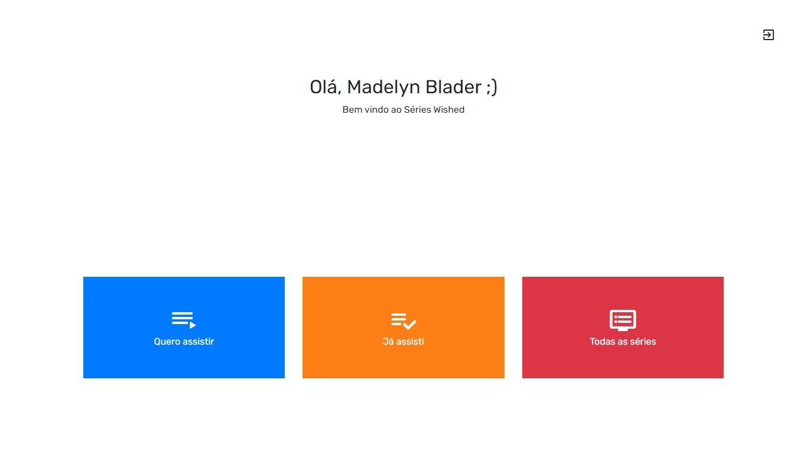

<h1 align="center">
    
</h1>

<h4 align="center"> 
	🚧 Series Wished  🚀 em construção... 🚧
</h4> 

<p align="center">
  
  
  <a href="https://www.twitter.com/douglasabnovato/">
    
  </a>
</p>

## 💻 Sobre o projeto

♻️ Series Wished

- Vue.js 
- Aplicação SPA  
- controlar lista de desejo de séries de tv 
- Vuex e autenticação com API Rest
- consumir uma API Rest
- manter a sessão no frontend
- usando o token JWT 
 
## 🎨 Layout

### 1 estruturando o projeto

- [x] API na pasta webserver: `npm run start` : `http://localhost:5000/`
- [x] Criar a aplicação vuejs : `vue create series-wished`
- [x] Aplicação: `npm run serve` : `http://localhost:8080/`
- [x] Versões : npm v6.13.7 e node v13.2.0
- [x] Dependências : `npm install --save bootstrap vue-resource`
- [x] Vuex : gerenciador de estado global da aplicação
- [x] Fonts Google : mandali
- [x] Até o minuto 11:36 é para estruturar o projeto.
- [x] vue-resource para fazer as requisições para API Rest usada na aplicação
- [x] http/index.js - VueResource

### 2 começando a usar Vuejs no Login   

- [x] API local: pasta webserver : endereço : `http://localhost/5000/`
- [x] API no Heroku: `https://guarded-headland-11685.herokuapp.com`
- [x] desenho da página Login
- [x] rota de: Login e Home
- [x] store: index.js, actions.js, mutation.types.js, mutations.js, state.js
- [x] Vuex para autentivação
- [x] fluxo de autenticação para manter token na sessão

### 3 finalizando o fluxo da autenticação

- [x] como funciona uma api rest
- [x] armazenar o token da sessão: application, localstorage
- [ ] errors and warnings

### 4 home e watchlist

- [ ] #5 finalizando watchlist e navbar
- [ ] #6 finalizando página da série
- [ ] #7 finalizando páginas restantes
- [ ] #8 adicionando e removendo das listas 

### Web - v1.0

<p align="center" style="display: flex; align-items: flex-start; justify-content: center;">
  
</p> 

## 🛠 Tecnologias

As seguintes ferramentas foram usadas na construção do projeto:

- [Css][css]: posicionamento, dimensionamento e muito mais
- [Javascript][javascript]
- [HTML][html]: estrutura e efeitos 
- [Git][git]
- [Github][github] 
- [Vuejs][vuejs] 

## 🚀 Como executar o projeto

Podemos considerar este projeto como sendo com uma parte:
- webserver: projeto backend com api
- series-wished: projeto frontend web 
- Node.js: v.10.15.0; NPM: v.6.4.1; Vue CLI: v.3.2.1; Vue.js: v.2.6.10; Vuex: v.3.0.1; Vue Router: v.3.0.3; Vue Resource: v.1.5.1

### Pré-requisitos

Antes de começar, você vai precisar ter instalado em sua máquina as seguintes ferramentas:
[Git](https://git-scm.com), [Node.js][nodejs]. 
Além disto é bom ter um editor para trabalhar com o código como [VSCode][vscode]

### 🧭 Rodando a aplicação web (Front End)

```bash 
# Clone este repositório
$ git clone https://github.com/douglasabnovato/series-wished/series-wished

# Acesse a pasta do projeto no seu terminal/cmd
$ cd series-wished

# Instale as dependências
$ npm install

# Execute a aplicação em modo de desenvolvimento
$  

# A aplicação será aberta na porta:3000 - acesse http://localhost:3000

```

### 🧭 Rodando a aplicação web (Back End)

```bash 
# Clone este repositório
$ git clone https://github.com/douglasabnovato/series-wished/webserver

# Acesse a pasta do projeto no seu terminal/cmd
$ cd webserver

# Instale as dependências
$ npm install

# Execute a aplicação em modo de desenvolvimento
$  

# A aplicação será aberta na porta:3000 - acesse http://localhost:3000

```

## 😯 Como contribuir para o projeto

1. Faça um **fork** do projeto.
2. Crie uma nova branch com as suas alterações: `git checkout -b my-feature`
3. Salve as alterações e crie uma mensagem de commit contando o que você fez: `git commit -m "feature: My new feature"`
4. Envie as suas alterações: `git push origin my-feature`
> Caso tenha alguma dúvida confira este [guia de como contribuir no GitHub](https://github.com/firstcontributions/first-contributions)


## 📝 Licença

Este projeto esta sobe a licença MIT.

Feito com ❤️ por Douglas A B Novato 👋🏽 [Entre em contato!](https://www.linkedin.com/in/douglasabnovato/)

[vuejs]: https://vuejs.org/
[git]: https://git-scm.com/doc
[github]: https://docs.github.com/en
[nodejs]: https://nodejs.org/
[typescript]: https://www.typescriptlang.org/
[expo]: https://expo.io/
[reactjs]: https://reactjs.org
[rn]: https://facebook.github.io/react-native/
[yarn]: https://yarnpkg.com/
[vscode]: https://code.visualstudio.com/
[vceditconfig]: https://marketplace.visualstudio.com/items?itemName=EditorConfig.EditorConfig
[license]: https://opensource.org/licenses/MIT
[vceslint]: https://marketplace.visualstudio.com/items?itemName=dbaeumer.vscode-eslint
[prettier]: https://marketplace.visualstudio.com/items?itemName=esbenp.prettier-vscode
[rs]: https://rocketseat.com.br 
[css]: https://developer.mozilla.org/en-US/docs/Web/CSS 
[html]: https://developer.mozilla.org/en-US/docs/Web/HTML
[javascript]: https://developer.mozilla.org/en-US/docs/Web/JavaScript 

Fonte - [Vue.js + Vuex + Autenticação com API Rest |Arthur Oliveira](https://www.youtube.com/playlist?list=PL7SyCwLzd5juMkMfe36pamqyK_8ugM-l3) 